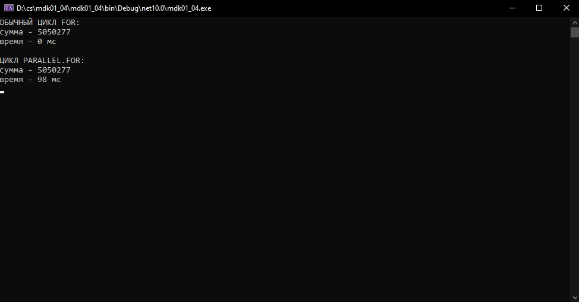

Выполнила: студентка Варламова Юлия Александровна, группы №24

О работе: 
Написала программу на C#, которая создаёт массив из 100 000 случайных чисел и считает их сумму двумя способами: через обычный цикл for, который работает последовательно, одно число за другим, и через цикл Parallel.For, который работает параллельно, используя несколько потоков. Программа выводит в консоль сумму и время выполнения каждого способа, чтобы можно было сравнить производительность.

Как запустить: 
Откройте командную строку, перейдите в папку с проектом и введите команду "dotnet run". Или откройте проект в Visual Studio, нажмите "F5".

Пример вывода программы:   
ОБЫЧНЫЙ ЦИКЛ FOR:  
сумма - 5050410  
время - 0 мс  
  
ЦИКЛ PARALLEL.FOR:  
сумма - 5050410  
время - 45 мс  

Скриншот вывода программы:  

